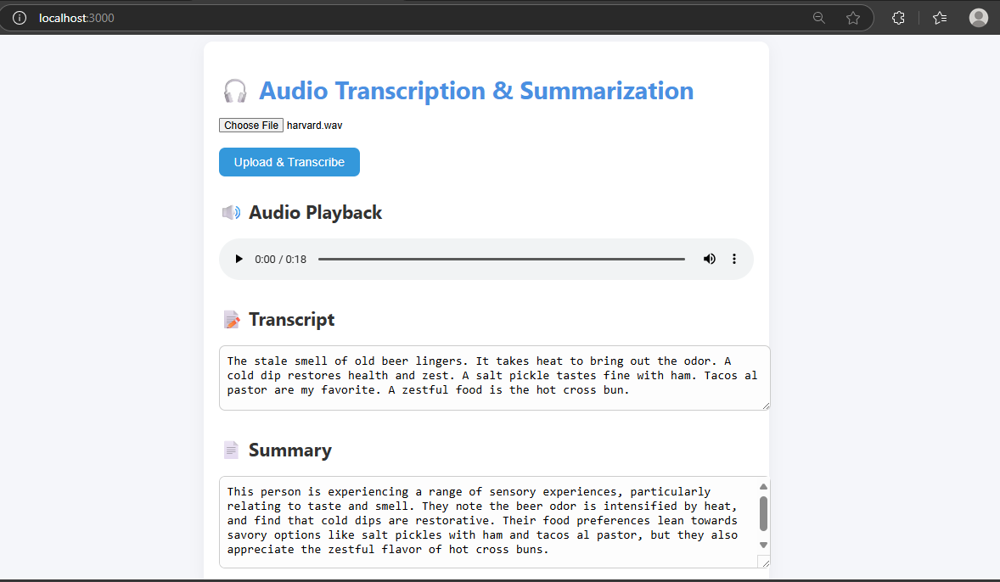

# 🎧 Audio Transcription & Summarization Web App

A full-stack web app that lets users upload an audio file, transcribes it to text, and generates a concise summary using AI.

## 🛠 Tech Stack

- **Frontend:** React.js
- **Backend:** Node.js + Express
- **Database:** PostgreSQL
- **APIs Used:**
  - AssemblyAI (Speech-to-Text)
  - Google Gemini (Text Summarization)

---

## Features

- Upload audio files (`.mp3`, `.wav`, etc.)
- Audio playback
- Transcribed text display
- AI-generated summary
- PostgreSQL storage (transcript, summary, timestamps)

---

## Getting Started

Clone the Repository and setup the backend

```bash
git clone https://github.com/your-username/audio-transcription-app.git
cd audio-transcription-app
cd server-backend
npm install
node index.js
```
Create a ".env" file and add the environmental variables ASSEMBLY_API_KEY, GEMINI_API_KEY, password of the database.
Now setup the frontend
```bash
cd ../myapp
npm install
npm start
```
To deploy this full-stack audio transcription and summarization app, you can host the frontend on Vercel
and the backend on Render (or a similar platform). First, push both frontend and backend code to 
GitHub. In the frontend, update deployed backend's URL (e.g., https://your-backend.onrender.com). 
On the backend side, deploy using Render by connecting GitHub repo and setting the required 
environment variables in the Render dashboard.After deploying both parts, the frontend will communicate
with the backend using the new URL instead of localhost.


